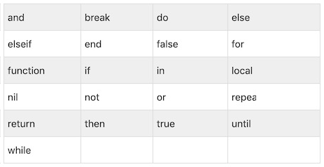

## Lua 基本语法

Lua 学习起来非常简单，我们可以创建第一个 Lua 程序！

### 一、第一个 Lua 程序
#### 1、交互式编程
Lua 提供了交互式编程模式。我们可以在命令行中输入程序并立即查看效果。

Lua 交互式编程模式可以通过命令 `lua -i` 或 `lua` 来启用：

```bash
$ lua -i 
$ Lua 5.3.5  Copyright (C) 1994-2018 Lua.org, PUC-Rio
>
```

在命令行中，输入以下 `print("Hello World！")` 命令，接着按下回车键，输出结果如下：
```bash
> print("Hello World！")
Hello World！
> 
```

#### 2、脚本式编程
我们可以将 Lua 程序代码保持到一个以 `lua` 结尾的文件，并执行，该模式称为脚本式编程，如我们将如下代码存储在名为 `hello.lua` 的脚本文件中：
```bash
print("Hello World！")
print("程序喵")
```

使用 lua 名执行以上脚本，输出结果为：
```bash
$ lua test.lua
Hello World！
程序喵
```

我们也可以将代码修改为如下形式来执行脚本（在开头添加：#!/usr/local/bin/lua）：
```bash
#!/usr/local/bin/lua

print("Hello World！")
print("程序喵")
```

以上代码中，我们指定了 Lua 的解释器 `/usr/local/bin` 目录。加上 `#` 号标记解释器会忽略它。

### 二、注释
#### 1、单行注释
两个减号是单行注释
```lua
--
```

#### 2、多行注释
```lua
--[[
 多行注释
 多行注释
 --]]
```

### 三、标示符
Lua 表示符用于定义一个变量，函数获取其他用户定义的项。标示符以一个字母 `A-Z` 或 `a-z` 或下划线 `_` 开头后加上`0`或多个字母，下划线，数字（`0-9`）。

最好不要使用下划线加大写字母的标示符，因为 Lua 的保留字也是这样的。

Lua 不允许使用特殊字符如 `@`, `$`, 和 `%` 来定义标示符。 Lua 区分大小

以下列出了一些正确的标示符：
```
mohd         zara      abc     move_name    a_123
myname50     _temp     j       a23b9        retVal
```

### 四、关键词
以下列出了 Lua 的保留关键字。保留关键字不能作为常量或变量或其他用户自定义标示符。



一般约定，以下划线开头连接一串大写字母的名字（比如 `_VERSION`）被保留用于 Lua 内部全局变量。

### 五、全局变量
在默认情况下，变量总是认为是全局的。

全局变量不需要声明，给一个变量赋值后即创建了这个全局变量，访问一个没有初始化的全局变量也不会出错，只不过得到的结果是：`nil`。

```lua
print(b)        --> nil
b=10
print(b)        --> 10 
```
如果你想删除一个全局变量，只需要将变量赋值为nil。
```lua
b = nil
print(b)      --> nil
```
这样变量 `b` 就好像从没被使用过一样。换句话说, 当且仅当一个变量不等于 `nil` 时，这个变量即存在。
