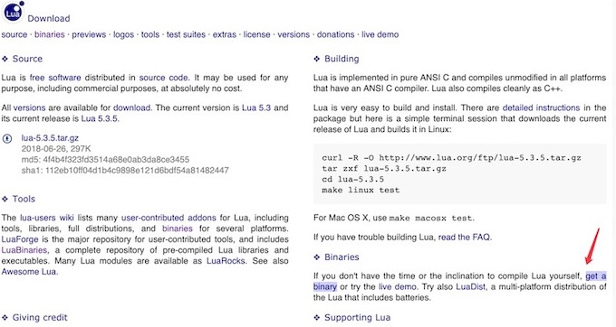

## 安装

### 一、Windows 系统

#### 下载方式1

进入Lua官网：http://www.lua.org ，点击 download


获取一个二进制文件 get a binary



点击左侧的 Download，选择自己需要的文件进行下载


#### 下载方式2

直接打开下载地址：http://joedf.ahkscript.org/LuaBuilds/ ，我的演示版本：`Lua-5.3.5_Win64_bin.zip`


#### 环境变量配置
解压之后有三个文件，分别是：`lua` 解释器、`luac` 编译器、`lua53.dll` 库文件


设置环境变量，把 Lua 的解压路径放进去。


### 二、Mac OS 系统
在Mac OS X上安装要在Mac OS X中构建/测试Lua，请使用以下命令
```bash
# 下载
$ curl -R -O http://www.lua.org/ftp/lua-5.3.5.tar.gz
# 解压
$ tar zxf lua-5.3.5.tar.gz
# 进入
$ cd lua-5.3.5
# 编译
$ make macosx test
# 安装
$ make install
```
在某些情况下，可能没有安装 `Xcode` 和命令行工具。 在这种情况下，将无法使用 `make` 命令。从mac app store安装Xcode。 然后转到Xcode的参考，然后切换到Downloads并安装名为“Command Line Tools”的组件。完成该过程后，就可以使用make命令。

- Google Code：https://code.google.com/archive/p/luaforwindows/downloads
- GitHub：https://github.com/rjpcomputing/luaforwindows/releases