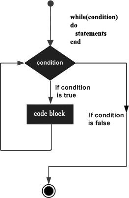
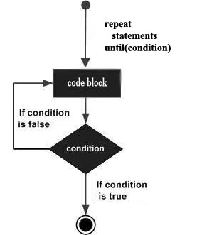

## Lua 循环

很多情况下我们需要做一些有规律性的重复操作，因此在程序中就需要重复执行某些语句。

一组被重复执行的语句称之为循环体，能否继续重复，决定循环的终止条件。

循环结构是在一定条件下反复执行某段程序的流程结构，被反复执行的程序被称为循环体。

循环语句是由循环体及循环的终止条件两部分组成的。


### 一、循环方式
Lua 提供了以下几种循环处理方式：

| 循环类型             | 描述                                                                          |
| -------------------- | ----------------------------------------------------------------------------- |
| `while` 循环         | 在条件为 true 时，让程序重复地执行某些语句。执行语句前会先检查条件是否为 true |
| `for` 循环           | 重复执行指定语句，重复次数可在 for 语句中控制。                               |
| Lua `repeat...until` | 重复执行循环，直到 指定的条件为真时为止                                       |
| 循环嵌套             | 可以在循环内嵌套一个或多个循环语句（while、for、do..while）                   |

#### 循环控制
循环控制语句用于控制程序的流程，以实现程序的各种结构方式。

| 控制语句     | 描述                                             |
| ------------ | ------------------------------------------------ |
| `break` 语句 | 退出当前循环或语句，并开始脚本执行紧接着的语句。 |

流程图如下


另外：Lua 并没有提供类似 `contrnue` 的语句。

### 二、循环类型介绍

#### 1、while 循环
Lua 编程语言中 while 循环语句在判断条件为 true 时会重复执行循环体语句。

##### 语法

```lua
while(condition) do
   statements
end
```

statements（循环体语句）可以是一条或多条语句，condition(条件) 可以是任意表达式，在 condition(条件) 为 true 时执行循环体语句。

#### 流程图如下：



在以上流程图中我们可以看出在 condition(条件)为 false 时会跳过当前循环并开始脚本执行紧接着的语句。

实例
以下实例循环输出 a 的值：

```lua
a=10
while(a < 15) do
    print("a 的值为:", a)

    if(a==12) then
        print("execute break" );
        break
    end

   a = a+1
end
```
执行以上代码，输出结果如下：
```
a 的值为:	10
a 的值为:	11
a 的值为:	12
```

#### 2、for 循环
Lua `for` 循环是一种重复控制结构，用于有效地编写需要执行特定次数的循环。

其中 for 语句有：**数值循环**、**泛型循环** 两种类型。

##### 数值for循环
语法格式
```lua
for var=exp1, exp2, exp3 do  
    <执行体>  
end
```
var 从 exp1 变化到 exp2，每次变化以 exp3 为步长递增 var，并执行一次"执行体"。exp3 是可选的，如果不指定，默认为1。

```lua
for i=1, 6 do
    print(i)            --> 依次打印：1到6
end

for i=10, 1, -1 do
    print(i)            --> 依次打印：10到1
end
```

三个表达式在循环开始前一次性求值，以后不再进行求值。比如下面的 `f(x)` 只会在循环开始前执行一次，其结果用在后面的循环中。

```lua
function f(x)  
    print("function")  
    return x*2   
end  

for i=1, f(3) do 
    print(i)  
end 
```
结果如下
```
function
1
2
3
4
5
6
```
可以看到 函数 `f(x)` 只在循环开始前执行一次。

##### 泛型for循环
泛型for循环通过一个迭代器函数来遍历所有值，类似java中的 `foreach` 语句。语法格式如下。
```lua
--打印数组a的所有值
for i, v in ipairs(a) do 
    print(v) 
end
```

- `i` 是数组索引值
- `v` 是对应索引的数组元素值。
- `ipairs` 是Lua提供的一个迭代器函数，用来迭代数组。

实例如下
```lua
days = {"Suanday", "Monday", "Tuesday", "Wednesday", "Thursday", "Friday", "Saturday"}
for i, v in ipairs(days) do
    print(i, v)
end
```
以上实例输出结果为：
```
1	Suanday
2	Monday
3	Tuesday
4	Wednesday
5	Thursday
6	Friday
7	Saturday
```

#### 3、repeat...until 循环
`repeat...until` 循环保证至少执行一次，循环在底部检查循环的条件。类似于java中的 `do..while` 循环。

语法如下
```lua
repeat
   statement(s)
until( condition )
```

- statements (循环体语句)：可以是一条或多条语句
- condition (条件)：可以是任意表达式，条件为 true 时执行循环体语句，为 false 时会跳过当前循环。

循环流程图如下：



示例代码
```lua
a = 10

repeat
   print("value of a:", a)
   a = a + 1
until( a > 13 )
```
执行结果
```
value of a:    10
value of a:    11
value of a:    12
value of a:    13
```

#### 4、循环嵌套
Lua 编程语言中允许循环中嵌入循环。以下实例演示了 Lua 循环嵌套的应用。

`for` 循环嵌套语法格式
```lua
for init, max/min value, increment do
   for init, max/min value, increment do
      statements
   end
   statements
end
```

`while` 循环嵌套语法格式:
```lua
while(condition) do
   while(condition) do
      statement(s)
   end
   statement(s)
end
```

`repeat...until` 循环嵌套语法格式:
```lua
repeat
    statements
    repeat
        statements
    until(condition)
until(condition)
```
除了以上同类型循环嵌套外，我们还可以使用不同的循环类型来嵌套，如 `for` 循环体中嵌套 `while` 循环。

```lua
j = 2
for i=2,10  do
   for j=2,(i/j) , 2 do
      if(not(i%j)) then
         break 
      end
      if(j > (i/j)) then
         print("i 的值为：",i)
      end
   end
end
```
运行结果
```
i 的值为：	8
i 的值为：	9
i 的值为：	10
```


