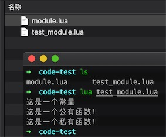

## Lua 模块与包
模块类似于一个封装库，从 Lua 5.1 开始，Lua 加入了标准的模块管理机制，可以把一些公用的代码放在一个文件里，以 API 接口的形式在其他地方调用，有利于代码的重用和降低代码耦合度。

### 一、模块
Lua 的模块是由变量、函数等已知元素组成的 `table`，因此创建一个模块很简单，就是创建一个 table，然后把需要导出的常量、函数放入其中，最后返回这个 table 就行。

以下为创建自定义模块 `module.lua`，文件代码格式如下：
```lua
-- 文件名为 module.lua
-- 定义一个名为 module 的模块
module = {}
 
-- 定义一个常量
module.constant = "这是一个常量"
 
-- 定义一个函数
function module.func1()
    io.write("这是一个公有函数！\n")
end
 
local function func2()
    print("这是一个私有函数！")
end
 
function module.func3()
    func2()
end
 
return module
```
由上可知，模块的结构就是一个 `table` 的结构，因此可以像操作调用 table 里的元素那样来操作调用模块里的常量或函数。

上面的 `func2` 声明为程序块的局部变量，即表示一个私有函数，因此是不能从外部访问模块里的这个私有函数，必须通过模块里的公有函数来调。

### 二、require 函数
Lua 提供了一个名为 `require` 的函数用来加载模块。要加载一个模块，只需要简单地调用就可以了。例如：
```lua
require("<模块名>")
-- 或者
require "<模块名>"
```

执行 `require` 后会返回一个由模块常量或函数组成的 `table`，并且还会定义一个包含该 `table` 的全局变量。
```lua
-- module 模块为上文提到到 module.lua
require("module")
 
print(module.constant)      --> 这是一个常量
module.func1()              --> 这是一个公有函数！
module.func3()              --> 这是一个私有函数！
```

**注意：** （1）将运行的模块和文件放在同一目录中。（2）模块名称及其文件名相同。



或者可以给加载的模块定义一个局部的别名变量。
```lua
-- 别名变量 m
local m = require("module")
print(m.constant)      --> 这是一个常量
m.func1()              --> 这是一个公有函数！
m.func3()              --> 这是一个私有函数！
```

还可以为个别函数设置不同的名称。
```lua
local m = require("module")
local f = m.func1

print(m.constant)       --> 这是一个常量
f()                     --> 这是一个公有函数！
m.func3()               --> 这是一个私有函数！
```
